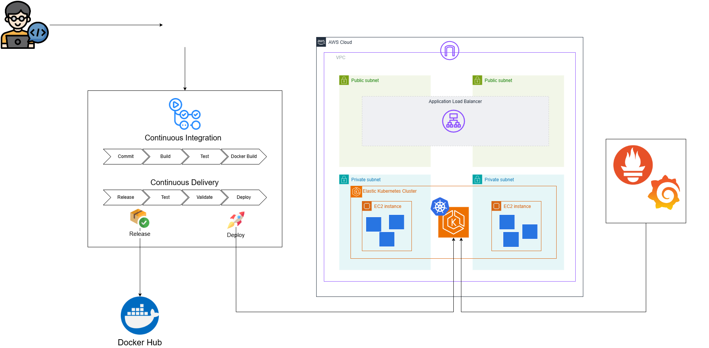

# Projeto Fake Shop
## Objetivo
O objetivo do projeto é ser um pequeno e-commerce para ser usado como prova de conceito para o processo de deploy de uma aplicação em ambiente Kubernetes com pipeline CI/CD e monitoramento.

## Premissas do Projeto
Para o desenvolvimento do projeto, segui as seguintes premissas:
- Utilizar containers Docker para facilitar o deploy no Kubernetes
- O deploy da aplicação vai ser feito em um cluster na AWS com Elastic Kubernetes Service
- Todo o processo de criação de release da aplicação e deploy no Kubernetes deve ser feito de forma automatica
- A aplicação e o cluster Kubernetes devem ser monitorados 

## Tecnologias relacionadas
- [Python](https://www.python.org/)
- [Flask](https://flask.palletsprojects.com/)
- [Docker](https://www.docker.com/)
- [Kubernetes](https://kubernetes.io/)
- [AWS](https://aws.amazon.com/pt/eks/)
- [Prometheus](https://prometheus.io/)
- [Grafana](https://grafana.com/grafana/)

## Configuração da Aplicação

A configuração da aplicação é feita usando variáveis de ambiente na aplicação e no banco de dados.

### Variáveis de Ambiente do PortgreSQL

As variáveis de ambiente do Postgre são detalhadas no Docker Hub:

https://hub.docker.com/_/postgres

### Variável de Ambiente da aplicação

DB_HOST => Host do banco de dados PostgreSQL.

DB_USER => Nome do usuário do banco de dados PostgreSQL.

DB_PASSWORD => Senha do usuário do banco de dados PostgreSQL.

DB_NAME => Nome do banco de dados PostgreSQL.

DB_PORT => Porta de conexão com o banco de dados PostgreSQL.

## Estrutura da aplicação

Esse é o diagrama do projeto de pipeline e monitoramento:

